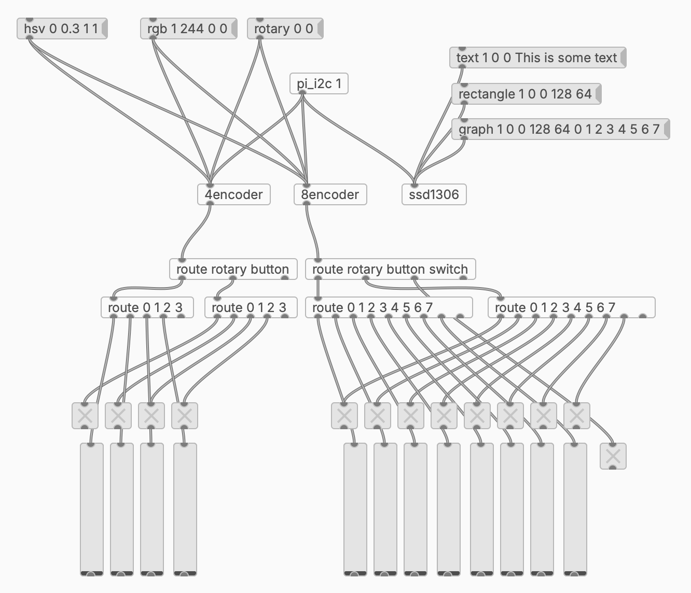

> [!WARNING]  
> I am still workign on this.

This contains the C drivers & puredata-extensions for these 3 devices on pi:

- [an i2c 8 rotary-encoder thing](https://docs.m5stack.com/en/unit/8Encoder)
- [an i2c 4 rotary-encoder thing](https://www.adafruit.com/product/5752)
- [an i2c 128x64 OLED](https://www.amazon.com/Serial-Yellow-Display-Module-SSD1306/dp/B07SW9X2H2?th=1) [adafruit](https://www.adafruit.com/product/326) - you can find these all over for cheap


The basic structure is like this in pd:



Basically, initialize the i2c bus with `pi_i2c` then connect that outlet to the others. 

## messages

```
pi_i2c
  inlet 1 messages
    INT - connect to a bus (same as i2cdetect, try 1)

  outlet 1 messages
    connect FD - this tells other patches what i2c bus to connect to

4encoder
  params

    address - int, default:73 (0x49)
  
  inlet 1 messages

    hsv ID H S V - set the color - ID is 0-3, H/S/V are float 0-1
    rgb ID R G B - set the color - ID is 0-3, R/G/B are int 0-255
    rotary ID VAL - set the rotary value - ID is 0-3, VAL is int -2147483648 - 2147483647

  outlet 1 messages

    rotary ID VAL - on change, ID is 0-3, VAL is int -2147483648 - 2147483647
    button ID VAL - on change, ID is 0-3, VAL is int 0/1


8encoder
  params

    address - int, default:65 (0x41)

  inlet 1 messages

    hsv ID H S V - set the color - ID is 0-7, H/S/V are float 0-1
    rgb ID R G B - set the color - ID is 0-7, R/G/B are int 0-255
    rotary ID VAL - set the rotary value - ID is 0-7, VAL is int -2147483648 - 2147483647

  outlet 1 messages

    rotary ID VAL - on change, ID is 0-7, VAL is int -2147483648 - 2147483647
    button ID VAL - on change, ID is 0-7, VAL is int 0/1


ssd1306
  params
    address - int, default:60 (0x3c)

  inlet 1 messages
    text COLOR X Y ...TEXT - COLOR is 0/1
    rectangle COLOR X Y W H - COLOR is 0/1
    circle COLOR X Y R - draw a cirlce, COLOR is 0/1
    triangle COLOR X0 Y0 X1 Y1 X2 Y2 - draw a triangle with 3 points, COLOR is 0/1
    line COLOR X0 Y0 X1 Y1 - draw a line between 2 points, COLOR is 0/1
    graph COLOR X Y W H ...NUMBERS - creates a scaled graph of NUMBERS that fits in the rect, COLOR is 0/1
    clear - clear the display
    scroll TYPE - do something with hardware-scrolling, TYPE is RIGHT/LEFT/DIAGRIGHT/DIAGLEFT/STOP
    rotate DEG - rotate screen. DEG is 0-359
    bitmap X Y NAME - display a 1bit bitmap file (not done yet)
    bang - render the current screen (call this on every change)
```


## setup

Make sure to add this to your `/boot/firmware/config.txt`:

```
# dtparam=i2c_arm=on,i2c_arm_baudrate=50000
# dtparam=i2c_arm=on,i2c_arm_baudrate=100000
# dtparam=i2c_arm=on,i2c_arm_baudrate=400000
dtparam=i2c_arm=on,i2c_arm_baudrate=1000000
```

You will need these things to build:

```
sudo apt install libi2c-dev build-essential
```